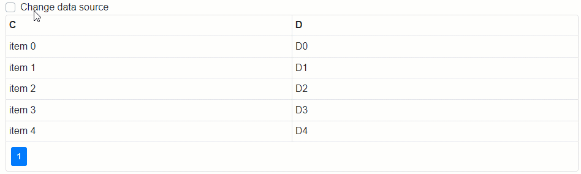

<!-- default badges list -->

[](https://supportcenter.devexpress.com/ticket/details/T848300)
[](https://docs.devexpress.com/GeneralInformation/403183)
<!-- default badges end -->

# DataGrid for Blazor - How to create the DataGrid and its columns at runtime

This example shows how to create the Data Grid component at runtime and generate its columns dynamically.



To do this, implement a method that returns the **RenderFragment<T>** object, for example, as follows:

```
RenderFragment<DataItem> buildGridsWithColumns = (dataObject) =>
@{ RenderFragment<DataItem> buildGridsWithColumns = (dataObject) =>
    @<DxDataGrid CssClass="mw-1100" @ref="grid" Data="@dataObject.Data">
        <Columns>
            @foreach (var column in dataObject.ColumnNames)
            {
                <DxDataGridColumn @key="@column" Caption="@column" Field="@column" Width="400px" />
            }
        </Columns>
    </DxDataGrid>; 
}
```

This method call creates a Data Grid with columns.

<!-- default file list -->
## Files to Look At

* [Index.razor](./CS/BlazorProject/Pages/Index.razor)
<!-- default file list end -->

## Documentation

* [Data Grid - Class Description](https://docs.devexpress.com/Blazor/DevExpress.Blazor.DxDataGrid-1)

## More Examples

* [Data Grid - Show Columns Based on External UI Elements](https://github.com/DevExpress-Examples/blazor-DxDataGrid-hide-column-based-on-certain-property)
